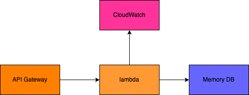

# Welcome to URL shortener project
## Useful commands

* `npm run test`         perform the jest unit tests
* `cdk deploy`           deploy this stack to your default AWS account/region
* `cdk diff`             compare deployed stack with current state
* `cdk synth`            emits the synthesized CloudFormation template

# Project components: 

For this project, I used 3 main components: 
* API Gateway allows lambda funciton to receive incoming traffic
* Lambda where most of our business logic for url shortener lives, it receives the request from API Gateway, processes the url and stores/retrieves from Memory DB.
* Memory DB that serves as an database to store and retrieve URLs. I chose memory DB(redis) for its ease of use. 

## What is included in this repo
* cdk code that creates the necessary resources of lambda(role, default lambda security group that you get for free, and the lambda function itself)

## what is not included in this repo
* API Gateway was set up manually on aws console, ideally we should create a stack in this repo for it. 
* MemoryDB was created manually on aws console, ideally we should create a stack in this repo for it. 

## Things to improve on:
* I put all of the url shortener logic inside of a single file/funciton, perhaps there's a case to be made that these logic should be seperated into 2 functions.

* All of the resources used by lambda, if not shared by other microservices, should be converted into cdk code and checked into this repo. 

* The actual lambda logic isn't perfect, can be imporved. 

## Operational challenges 
guarantee handling of traffic bursts with over 9000 parallel requests?
* we could adjust API Gateway's throttling settings, such as maximum RPS and burst limits. Can increase the default RPS limit of 10,000 to a higher value that can handle the expected traffic bursts. Also can utilize the Application Auto Scaling to automatically adjust provisioned concurrency for lambda function.  

minimize monthly cloud provider costs as much as possible?
* We could find the right size memory for our lambda function, if this service isn't used much then downgrade the memory size to a lower tier or even free tier. 

protect the POST action so that only our administrators can submit URLs?
* API Gateway provides a built-in authorization mechanisms, such as API keys or custom authorizers, to control access to the POST action.